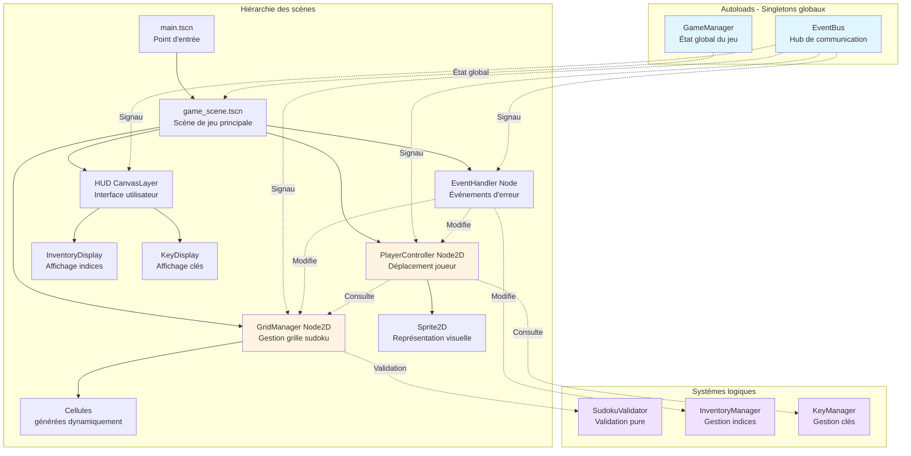

# Architecture Godot - Lab-doku

Ce document décrit l'architecture technique du prototype digital Lab-doku et les patterns utilisés.

> **Note importante** : Les extraits de code GDScript dans ce document sont des exemples illustratifs. Une fois l'implémentation réalisée, ils devront être **remplacés par des liens vers les fichiers de script réels** pour éviter la duplication et garantir la cohérence avec le code source.

## Vue d'ensemble

### Principes architecturaux

1. **Séparation des responsabilités** : Chaque système gère un aspect précis du jeu
2. **Communication par signaux** : Couplage faible entre les composants
3. **Autoloads pour l'état global** : GameManager et EventBus comme singletons
4. **Hiérarchie de scènes claire** : main → game_scene → grid/player/ui
5. **Validation centralisée** : SudokuValidator comme source de vérité

### Diagramme de l'architecture



## Systèmes principaux

### 1. GameManager (Autoload)

**Responsabilité** : Gestion de l'état global du jeu et coordination des systèmes.

**Fichier** : `scripts/autoloads/game_manager.gd`

**État géré** :

```gdscript
class_name GameManager
extends Node

# Configuration de partie
var grid_size: int = 4
var difficulty: String = "normal"

# État de partie
var is_game_active: bool = false
var error_count: int = 0
var placement_count: int = 0
var start_time: float = 0.0

# Paramètres de jeu (à charger depuis GODOT_PROTO_SPECS.md)
const STARTING_KEYS_COUNT = 2
const STARTING_INDICES_COUNT = 2
const MAX_SAME_NUMBER_TOTAL = 4

const EVENT_PROBABILITIES = {
    "loss": 0.7,
    "teleportation": 0.3,
    "explosion": 0.0
}
```

**Responsabilités** :

- Initialiser une nouvelle partie
- Tracker les statistiques globales
- Fournir l'accès aux paramètres constants
- Gérer la victoire/défaite

### 2. EventBus (Autoload)

**Responsabilité** : Hub centralisé pour la communication inter-systèmes via signaux.

**Fichier** : `scripts/autoloads/event_bus.gd`

**Pattern** : Singleton avec signaux globaux pour découpler les composants.

```gdscript
class_name EventBus
extends Node

# Signaux de gameplay
signal player_moved(from: Vector2i, to: Vector2i)
signal cell_placement_attempted(position: Vector2i, number: int)
signal cell_placement_validated(position: Vector2i, number: int, is_correct: bool)

# Signaux de ressources
signal key_obtained(number: int)
signal index_collected(number: int)
signal index_consumed(number: int)
signal index_lost(number: int)

# Signaux d'événements
signal error_event_triggered(event_type: String)
signal explosion_occurred(center: Vector2i, affected_cells: Array[Vector2i])
signal teleportation_occurred(from: Vector2i, to: Vector2i)

# Signaux de série complétée
signal series_completed(series_type: String, index: int)  # "row", "column", "block"

# Signaux de fin de partie
signal game_won()
signal game_lost()
```

**Utilisation** :

```gdscript
# Émission depuis n'importe quel script
EventBus.cell_placement_validated.emit(pos, number, true)

# Écoute depuis n'importe quel script
func _ready():
    EventBus.key_obtained.connect(_on_key_obtained)

func _on_key_obtained(number: int):
    print("Clé obtenue : %d" % number)
```

### 3. GridManager

**Responsabilité** : Gestion de l'état de la grille de sudoku (solution + état joueur).

**Fichier** : `scripts/game/grid_manager.gd`

**Structure de données** :

```gdscript
class_name GridManager
extends Node2D

# Grilles internes (2D arrays)
var _solution_grid: Array[Array] = []  # Grille solution (immuable)
var _player_grid: Array[Array] = []    # Grille joueur (mutable)
var _cell_states: Array[Array] = []    # États des cellules (EMPTY/PREFILLED/PLAYER_FILLED)

# Mapping position → node Cell (pour les opérations visuelles)
var _cell_nodes: Dictionary = {}  # Vector2i -> Cell

# Configuration
const GRID_SIZE = 4
const CELL_SIZE = 64
```

**API publique** :

```gdscript
# Interrogation
func get_cell_number(pos: Vector2i) -> int
func get_cell_state(pos: Vector2i) -> CellState
func is_position_valid(pos: Vector2i) -> bool
func get_prefilled_positions() -> Array[Vector2i]

# Modification
func place_number(pos: Vector2i, number: int) -> bool
func clear_cell(pos: Vector2i) -> void
func clear_cells(positions: Array[Vector2i]) -> void

# Vérification
func is_series_completed(series_type: String, index: int) -> bool
func is_grid_complete() -> bool
```

**Collaboration** :

- Délègue la validation à `SudokuValidator`
- Émet des signaux via `EventBus` lors de changements d'état
- Met à jour les nodes `Cell` enfants pour le rendu visuel

### 4. SudokuValidator

**Responsabilité** : Validation pure des règles de sudoku (sans état, sans side-effects).

**Fichier** : `scripts/game/sudoku_validator.gd`

**Pattern** : Classe utilitaire statique (pas de `extends Node`, juste des fonctions statiques).

```gdscript
class_name SudokuValidator

# Validation de placement
static func is_placement_valid(grid: Array[Array], pos: Vector2i, number: int) -> bool:
    return (
        _is_valid_in_row(grid, pos.y, number) and
        _is_valid_in_column(grid, pos.x, number) and
        _is_valid_in_block(grid, pos, number)
    )

# Vérification de complétion
static func is_series_complete(grid: Array[Array], series_type: String, index: int) -> bool:
    var cells = _get_series_cells(series_type, index)
    for cell_pos in cells:
        if grid[cell_pos.y][cell_pos.x] == 0:
            return false
    return true

static func is_grid_complete(grid: Array[Array]) -> bool:
    for row in grid:
        for cell in row:
            if cell == 0:
                return false
    return true

# Fonctions privées
static func _is_valid_in_row(grid: Array[Array], row: int, number: int) -> bool:
    # ...

static func _is_valid_in_column(grid: Array[Array], col: int, number: int) -> bool:
    # ...

static func _is_valid_in_block(grid: Array[Array], pos: Vector2i, number: int) -> bool:
    # ...
```

**Avantages** :

- Pas de dépendances externes
- Facilement testable (fonctions pures)
- Réutilisable dans différents contextes

### 5. PlayerController

**Responsabilité** : Gestion de la position du joueur et des déplacements.

**Fichier** : `scripts/game/player_controller.gd`

**État** :

```gdscript
class_name PlayerController
extends Node2D

var current_position: Vector2i = Vector2i(0, 0)
var can_move: bool = true  # Désactivé pendant animations/placements

@onready var sprite = $Sprite2D
```

**Flux de déplacement** :

```gdscript
func _unhandled_input(event: InputEvent):
    if not can_move:
        return

    var direction = _get_input_direction(event)
    if direction == Vector2i.ZERO:
        return

    var target_pos = current_position + direction

    # Vérifications (délégation)
    if not _grid_manager.is_position_valid(target_pos):
        return

    var target_number = _grid_manager.get_cell_number(target_pos)
    if target_number > 0 and not _key_manager.has_key(target_number):
        return  # Pas de clé, mouvement impossible

    # Mouvement autorisé
    _move_to(target_pos)
```

**Collaboration** :

- Interroge `GridManager` pour connaître l'état de la grille
- Interroge `KeyManager` pour vérifier les clés possédées
- Émet `EventBus.player_moved` après déplacement
- Gère les animations de mouvement (tween)

### 6. InventoryManager

**Responsabilité** : Gestion de l'inventaire d'indices numérotés.

**Fichier** : `scripts/game/inventory_manager.gd`

**État** :

```gdscript
class_name InventoryManager
extends Node

# Inventaire : dictionnaire {number: count}
var _inventory: Dictionary = {1: 0, 2: 0, 3: 0, 4: 0}

const MAX_SAME_NUMBER_TOTAL = 4  # Contrainte globale
```

**API publique** :

```gdscript
func add_index(number: int) -> void
func consume_index(number: int) -> bool
func has_index(number: int) -> bool
func get_count(number: int) -> int
func is_inventory_empty() -> bool
func get_total_count() -> int

# Contrainte globale (inventaire + grille)
func can_collect_index(number: int, grid_count: int) -> bool:
    return _inventory[number] + grid_count < MAX_SAME_NUMBER_TOTAL
```

**Collaboration** :

- Émet `EventBus.index_collected/consumed/lost` lors de modifications
- Consulté par `GridManager` pour vérifier les contraintes avant collecte

### 7. KeyManager

**Responsabilité** : Gestion des clés de couleur possédées par le joueur.

**Fichier** : `scripts/game/key_manager.gd`

**État** :

```gdscript
class_name KeyManager
extends Node

# Ensemble des clés possédées (Set simulé via Dictionary)
var _keys: Dictionary = {}  # {number: true}
```

**API publique** :

```gdscript
func add_key(number: int) -> void
func has_key(number: int) -> bool
func get_keys() -> Array[int]
```

**Collaboration** :

- Émet `EventBus.key_obtained` lors de l'ajout d'une clé
- Consulté par `PlayerController` pour autoriser les déplacements

### 8. EventHandler

**Responsabilité** : Gestion des événements d'erreur (explosion, téléportation, perte).

**Fichier** : `scripts/effects/event_handler.gd`

**Logique de sélection** :

```gdscript
class_name EventHandler
extends Node

const EVENT_PROBABILITIES = {
    "loss": 0.7,
    "teleportation": 0.3,
    "explosion": 0.0
}

func trigger_error_event() -> void:
    var event_type = _select_random_event()

    match event_type:
        "loss":
            _handle_loss_event()
        "teleportation":
            _handle_teleportation_event()
        "explosion":
            _handle_explosion_event()

func _select_random_event() -> String:
    var rand_value = randf()
    var cumulative = 0.0

    for event_type in EVENT_PROBABILITIES:
        cumulative += EVENT_PROBABILITIES[event_type]
        if rand_value <= cumulative:
            return event_type

    return "loss"  # Fallback
```

**Collaboration** :

- Écoute `EventBus.cell_placement_validated` pour détecter les erreurs
- Modifie `InventoryManager` (perte d'indice)
- Modifie `GridManager` (explosion de cellules)
- Modifie `PlayerController` (téléportation)
- Émet des signaux via `EventBus` pour les effets visuels

## Patterns utilisés

### Pattern 1 : Communication par signaux

**Principe** : Les composants ne se connaissent pas directement, ils communiquent via `EventBus`.

**Avantages** :

- Couplage faible : facile d'ajouter/retirer des composants
- Testabilité : chaque composant peut être testé isolément
- Flexibilité : plusieurs écouteurs peuvent réagir au même signal

**Exemple** : Placement d'un nombre

```gdscript
# GridManager émet
EventBus.cell_placement_validated.emit(pos, number, is_correct)

# Plusieurs composants réagissent
# 1. EventHandler : Déclenche événement si erreur
# 2. HUD : Met à jour les stats
# 3. InventoryManager : Ajoute un indice si correct
# 4. AudioManager (futur) : Joue un son
```

### Pattern 2 : Autoloads comme singletons

**Principe** : Les systèmes globaux (GameManager, EventBus) sont des singletons Godot.

**Configuration** : `Project Settings → Autoload`

```
GameManager -> scripts/autoloads/game_manager.gd (Enabled)
EventBus -> scripts/autoloads/event_bus.gd (Enabled)
```

**Accès** : Directement par le nom du singleton

```gdscript
GameManager.start_new_game()
EventBus.game_won.emit()
```

### Pattern 3 : Composition de scènes

**Principe** : Les scènes complexes sont composées de sous-scènes réutilisables.

**Exemple** : `game_scene.tscn`

```
GameScene (Node2D)
├── GridManager (Node2D)
│   └── Cell (instance de cell.tscn) x 16
├── PlayerController (Node2D)
│   └── Sprite2D
├── HUD (CanvasLayer)
│   ├── InventoryDisplay (instance de inventory_display.tscn)
│   └── KeyDisplay (instance de key_display.tscn)
└── EventHandler (Node)
```

**Avantages** :

- Réutilisation : `cell.tscn` peut être testé indépendamment
- Clarté : Hiérarchie visuelle dans l'éditeur
- Maintenance : Modifier `cell.tscn` met à jour toutes les instances

### Pattern 4 : Séparation logique/visuel

**Principe** : La logique métier est séparée du rendu visuel.

**Exemple** : GridManager

```gdscript
# GridManager (logique pure)
func place_number(pos: Vector2i, number: int) -> bool:
    # 1. Validation logique
    if not SudokuValidator.is_placement_valid(_player_grid, pos, number):
        return false

    # 2. Mise à jour état interne
    _player_grid[pos.y][pos.x] = number
    _cell_states[pos.y][pos.x] = CellState.PLAYER_FILLED

    # 3. Notification visuelle (délégation)
    _update_cell_visual(pos)

    return true

# Fonction privée pour le rendu
func _update_cell_visual(pos: Vector2i) -> void:
    var cell_node = _cell_nodes[pos]
    cell_node.set_number(_player_grid[pos.y][pos.x])
    cell_node.set_state(_cell_states[pos.y][pos.x])
```

**Avantages** :

- Testabilité : Logique testable sans rendu
- Performance : Découplage permet optimisations ciblées
- Maintenance : Changements visuels n'affectent pas la logique

### Pattern 5 : Validation centralisée

**Principe** : Toutes les règles de sudoku sont dans `SudokuValidator` (source de vérité unique).

**Anti-pattern à éviter** :

```gdscript
# ❌ Mauvais : validation dupliquée dans plusieurs scripts
# player_controller.gd
func can_place_number(pos, number):
    # Validation row/col/block ici

# grid_manager.gd
func place_number(pos, number):
    # Validation row/col/block ici aussi (duplication!)
```

**Pattern correct** :

```gdscript
# ✅ Bon : validation unique dans SudokuValidator
# player_controller.gd
func can_place_number(pos, number):
    return SudokuValidator.is_placement_valid(_grid_manager._player_grid, pos, number)

# grid_manager.gd
func place_number(pos, number):
    if not SudokuValidator.is_placement_valid(_player_grid, pos, number):
        return false
```

## Flux de données typiques

### Flux 1 : Déplacement du joueur

```
1. Joueur appuie sur flèche
   └─> PlayerController._unhandled_input()

2. Calcul position cible
   └─> target_pos = current_position + direction

3. Vérifications
   ├─> GridManager.is_position_valid(target_pos)
   ├─> GridManager.get_cell_number(target_pos)
   └─> KeyManager.has_key(target_number)

4. Mouvement autorisé
   ├─> PlayerController._move_to(target_pos)
   ├─> Animation (Tween)
   └─> EventBus.player_moved.emit(old_pos, new_pos)

5. Réactions
   ├─> HUD met à jour l'affichage position
   └─> [Futur] AudioManager joue son de pas
```

### Flux 2 : Placement d'un nombre (correct)

```
1. Joueur sur case vide, presse touche "1"
   └─> PlayerController._unhandled_input()

2. Vérifications inventaire
   └─> InventoryManager.has_index(1)

3. Tentative de placement
   └─> GridManager.place_number(current_position, 1)

4. Validation sudoku
   └─> SudokuValidator.is_placement_valid(grid, pos, 1)
   └─> Résultat : true

5. Mise à jour état
   ├─> GridManager._player_grid[y][x] = 1
   ├─> InventoryManager.consume_index(1)
   └─> EventBus.cell_placement_validated.emit(pos, 1, true)

6. Récompense
   ├─> InventoryManager.add_index(random(1-4))
   └─> EventBus.index_collected.emit(number)

7. Vérification série complétée
   └─> GridManager.is_series_completed("row", y)
   └─> Si true : EventBus.series_completed.emit("row", y)

8. Choix de clé (si série complétée)
   └─> UI affiche sélecteur de clé
   └─> KeyManager.add_key(chosen_number)

9. Vérification victoire
   └─> GridManager.is_grid_complete()
   └─> Si true : EventBus.game_won.emit()
```

### Flux 3 : Placement d'un nombre (erreur → perte)

```
1-4. Identique au flux 2

5. Validation sudoku
   └─> SudokuValidator.is_placement_valid(grid, pos, 1)
   └─> Résultat : false

6. Mise à jour état + notification
   ├─> GridManager efface le nombre (ne reste pas)
   ├─> InventoryManager.consume_index(1) (l'indice est perdu)
   ├─> GameManager.error_count += 1
   └─> EventBus.cell_placement_validated.emit(pos, 1, false)

7. Événement d'erreur
   └─> EventHandler._handle_loss_event()
   ├─> InventoryManager perd 1 indice aléatoire
   └─> EventBus.error_event_triggered.emit("loss")

8. Vérification défaite
   └─> InventoryManager.is_inventory_empty()
   └─> Si true : EventBus.game_lost.emit()
```

## Initialisation du jeu

**Séquence de démarrage** :

```
1. Godot lance main.tscn

2. Autoloads initialisés (avant toute scène)
   ├─> GameManager._ready()
   └─> EventBus._ready()

3. main.tscn instancie game_scene.tscn

4. game_scene._ready() déclenche initialisation
   └─> GameManager.start_new_game()

5. start_new_game() configure les managers
   ├─> GridManager.initialize(solution_grid, prefilled_positions)
   ├─> KeyManager.initialize(starting_keys)
   ├─> InventoryManager.initialize(starting_indices)
   └─> PlayerController.initialize(start_position)

6. Connexion des signaux
   └─> Chaque manager connecte ses signaux à EventBus

7. Jeu prêt
   └─> GameManager.is_game_active = true
```

## Tests et validation

### Tests unitaires

**Cibles prioritaires** :

1. `SudokuValidator` (fonctions pures, faciles à tester)
2. `InventoryManager` (logique contraintes)
3. `KeyManager` (logique simple)

**Exemple de test** :

```gdscript
# tests/unit/test_sudoku_validator.gd
extends GutTest

func test_is_placement_valid_row():
    var grid = [
        [1, 2, 3, 4],
        [0, 0, 0, 0],
        [0, 0, 0, 0],
        [0, 0, 0, 0]
    ]

    # Placement invalide (1 déjà présent dans row 0)
    assert_false(
        SudokuValidator.is_placement_valid(grid, Vector2i(0, 0), 1),
        "Should reject duplicate in row"
    )

    # Placement valide (5 n'existe pas dans row 1)
    assert_true(
        SudokuValidator.is_placement_valid(grid, Vector2i(0, 1), 1),
        "Should accept unique number in row"
    )
```

### Tests d'intégration

**Scénarios clés** :

1. Partie complète du début à la fin (victoire)
2. Placement avec déclenchement d'événements
3. Blocage du joueur (inventaire vide)

**Outil** : [Gut (Godot Unit Test)](https://github.com/bitwes/Gut)

## Évolutions futures

### Ajouts possibles (post-MVP)

1. **AudioManager** (autoload) : Gestion des sons et musiques
2. **SaveManager** (autoload) : Sauvegarde/chargement de parties
3. **SettingsManager** (autoload) : Configuration utilisateur
4. **TutorialManager** : Système de tutoriel intégré
5. **AnimationManager** : Coordination d'animations complexes

### Refactorings potentiels

- **Extraction de Constants.gd** : Centraliser toutes les constantes
- **State Machine pour PlayerController** : Gérer états IDLE/MOVING/PLACING
- **Command Pattern pour placements** : Permettre undo/redo

## Références

- [Godot Architecture Best Practices](https://docs.godotengine.org/en/stable/tutorials/best_practices/scene_organization.html)
- [Signals in Godot](https://docs.godotengine.org/en/stable/getting_started/step_by_step/signals.html)
- [Autoloads/Singletons](https://docs.godotengine.org/en/stable/tutorials/scripting/singletons_autoload.html)
- Spécifications techniques : `docs/GODOT_PROTO_SPECS.md`

**Dernière mise à jour** : 2025-11-11
